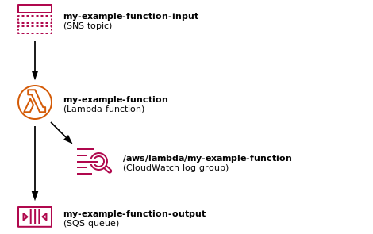

# terraform-python-lambda

This is a Terraform module for creating a single, standalone Python Lambda.
I use it when I want to use Lambda for some piece of one-off data processing – it doesn't need to be permanent infrastructure and I don't want to spend too long on it, I just want to run some Python inside AWS.

This is what it creates:



The Lambda reads from an SNS topic as input, writes any logs to CloudWatch, and sends its output to SQS.
I have tools for [publishing lots of messages to SNS][sns] and [downloading messages for SQS][sqs], which I use to handle the input/output.

[sns]: https://alexwlchan.net/2023/my-sns-firehose/
[sqs]: https://alexwlchan.net/2018/downloading-sqs-queues/

## Example use cases

*   I wanted to do an image similarity diff between pairs of images in S3.
    I wrote a Lambda function that took two S3 locations as input, downloaded the objects to local storage, used the [diffimg library](https://github.com/nicolashahn/diffimg) to get a percentage difference, then sent the score to SQS.

    I sent the S3 locations as messages to the SNS topic, and the Lambda chewed through 400k image pairs (15TB of data) in about an hour.
    Then I grabbed all the messages from SQS, and I had all the scores I needed.

    I'd previously been running the process on a large EC2 instance, and it only managed about 250 image pairs in the previous hour.

*   I wanted to get the SHA-1 and SHA-256 checksums of objects in S3 – the real checksum, not the "checksum of checksums" that S3 uses for multipart objects.

    I wrote a Lambda function that took an S3 location as input, downloaded the object, created the various checksums I wanted, then send the checksums to SQS.

## Usage

To create a Lambda function:

1.  Clone this repo.
2.  Fill in the descriptive metadata in `main.tf`.
    This is also where you can define any IAM permissions that your Lambda requires.
3.  Write your Python function in `src/main.py`.
    Anything you put in the `src` folder (e.g. extra files, Python libraries, data) will be included in the Lambda.
4.  Run `terraform init / plan / apply` to create the resources.

This will create an autogenerated README that describes your resources, how to send input and how to send output.

```console
$ terraform apply
...
next_steps = <<EOT
Your new function has been created!

For instructions on deploying new code, open README.html in your browser

EOT
```

and if you open `README.html` you'll see something like:


These are copy/paste commands that you can use, and the architecture diagram has clickable links to the AWS console.

The function you've written in `src` will be deployed every time you run `terraform apply`, so it may take a couple of tries to get it working correctly.
The Terraform should only take a minute or so to run, so I often deploy a bunch of versions before I get the "final" code that I actually run.
